# NBA Analysis

An end-to-end NBA analytics project that collects player and team data through web scraping, stores it in a normalized MySQL database, performs exploratory data analysis, applies K-Means clustering to identify player archetypes, and presents the results through interactive Metabase dashboards.

<div align="center">
  
</div>

## Table of Contents

- [Overview](#overview)
- [Features](#features)
- [Tech Stack](#tech-stack)
- [Database Schema](#database-schema)
- [Installation](#installation)
- [Results](#results)
- [Domain Knowledge](#domain-knowledge)
- [Data Source](#data-source)

## Overview

This project collects raw NBA statistics from Basketball-Reference, cleans and structures them into a relational database, and analyzes them through exploratory analysis, hypothesis testing, and a K-Means clustering model that groups players into archetypes based on advanced statistics.

## Features

**Web Scraping**
- Automated data collection from Basketball-Reference
- Extraction of player information, seasonal statistics, championship rosters, and MVP data

**Data Preprocessing**
- Cleaning and standardizing raw data
- Feature engineering
- Missing value handling

**Relational Database**
- Normalized MySQL schema (11+ tables)
- Foreign key relationships
- Efficient SQL querying

**Exploratory Data Analysis**
- Statistical summaries
- Data visualization
- Hypothesis testing

**Machine Learning**
- Feature scaling with StandardScaler
- Player clustering using K-Means
- PCA visualization of clusters
- Cluster profiling and interpretation

**Business Intelligence**
- Interactive dashboards using Metabase
- SQL analytics
- KPI visualizations
- Cluster-based player analysis

## Tech Stack

- Language: Python 3
- Database: MySQL
- Analysis and ML: pandas, scikit-learn (StandardScaler, K-Means, PCA)
- BI and Dashboards: Metabase
- Data Source: Basketball-Reference (web scraping)

## Database Schema

The database consists of 11 normalized tables:

```
country
college
position
season
team
player
player_college
player_position
player_season_stats
mvp_award
champion_team_player
```

These tables model the relationships between players, teams, seasons, countries, colleges, and NBA awards. The full database structure is defined in `database/schema.sql`.

## Installation

### 1. Clone the repository

```bash
git clone https://github.com/pxsa/NBA-Analysis.git
cd NBA-Analysis
```

### 2. Install requirements

```bash
pip install -r requirements.txt
```

### 3. Configure environment variables

Rename `.env-example` to `.env` and fill in your database credentials:

```
DB_USERNAME=root
PASSWORD=your_mysql_password
HOST=localhost
PORT=3306
DATABASE=basketball_db
```

## Results

Note: the captions below are placeholders inferred from figure filenames and section labels (h1, h2, q1, q2). Replace them with your actual findings from the notebooks before publishing.

### General EDA

Overview of feature distributions, position breakdowns, and trends across seasons.

<p align="center">
  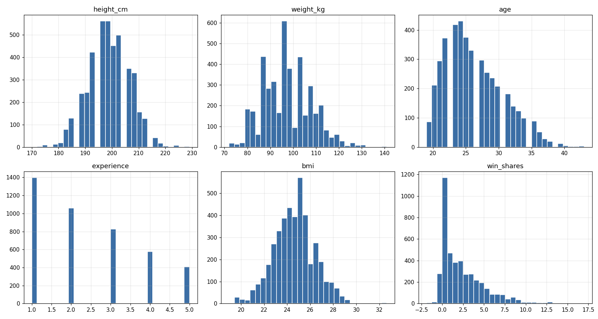
</p>

*Distribution of key numeric features across the full player-season dataset.*

<p align="center">
  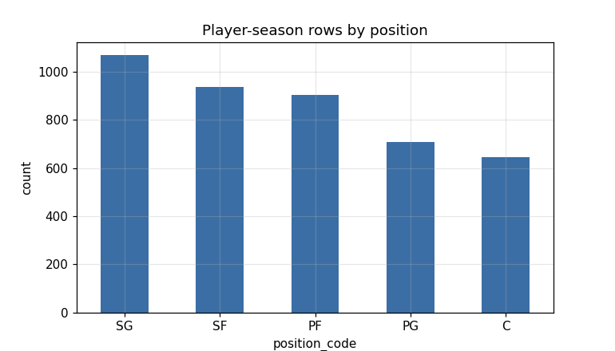
</p>

*Breakdown of players by position.*

<p align="center">
  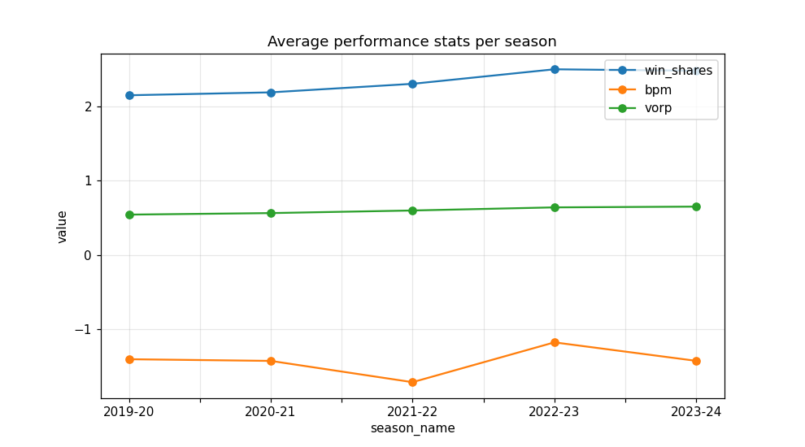
</p>

*Trends across the seasons covered by this dataset (2019-20 through 2025-26).*

### Categorical Feature Distributions

<table>
<tr>
<td>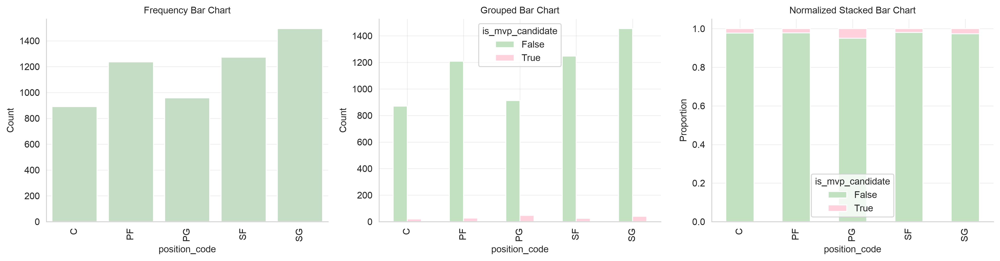</td>
<td>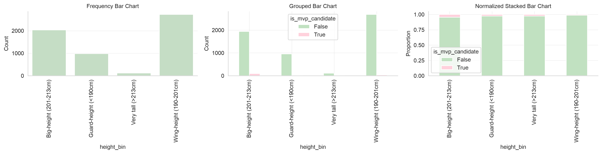</td>
</tr>
<tr>
<td align="center"><em>Player counts by position</em></td>
<td align="center"><em>Player counts by height bin</em></td>
</tr>
<tr>
<td>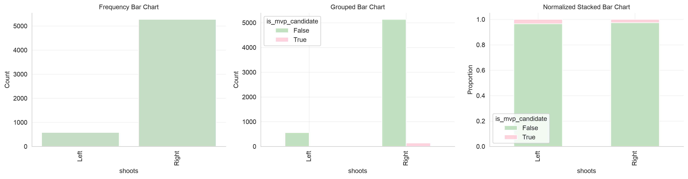</td>
<td>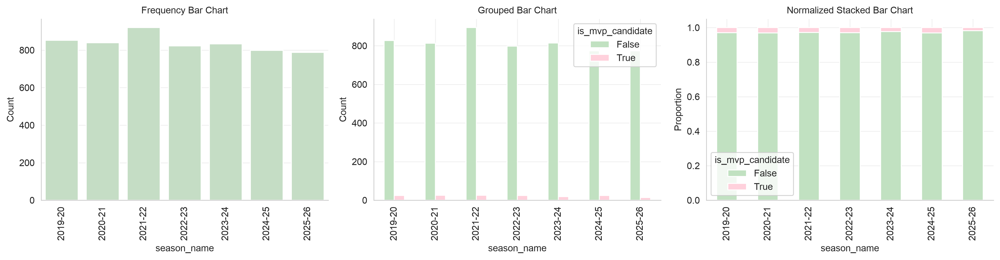</td>
</tr>
<tr>
<td align="center"><em>Player counts by shooting hand</em></td>
<td align="center"><em>Player counts by season</em></td>
</tr>
<tr>
<td>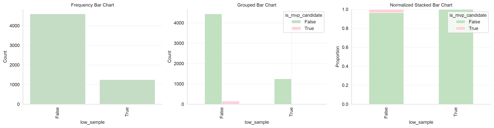</td>
<td></td>
</tr>
<tr>
<td align="center"><em>Players flagged as low-sample (limited minutes/games)</em></td>
<td></td>
</tr>
</table>

### Q1 — Height Analysis

<p align="center">
  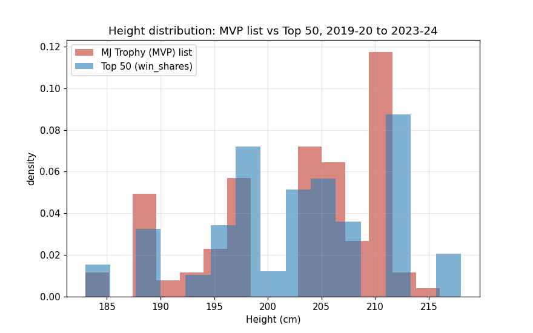
  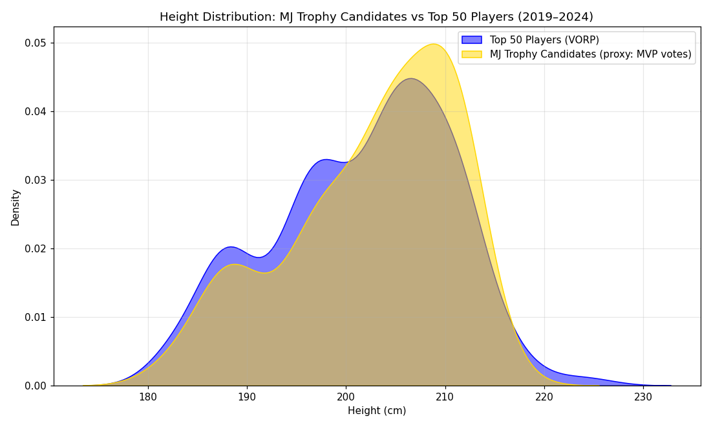
</p>

*Distribution and KDE of player height (cm) across the dataset.*

### Q2 — Champions vs. Top-15

<p align="center">
  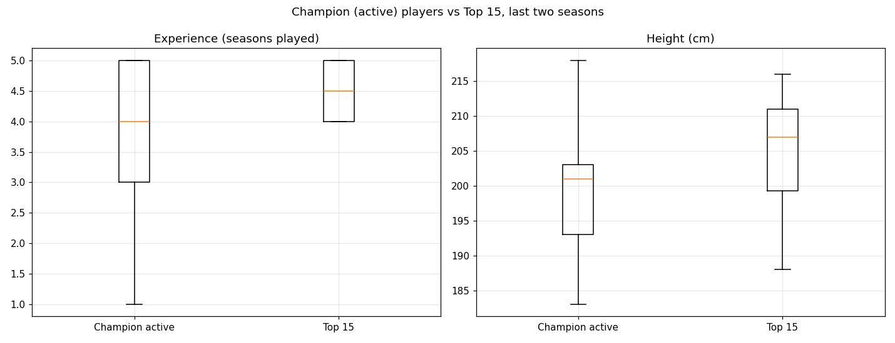
</p>

*Comparison between championship-roster players and the top-15 players by performance metric.*

### H1 — Agility Hypothesis

<p align="center">
  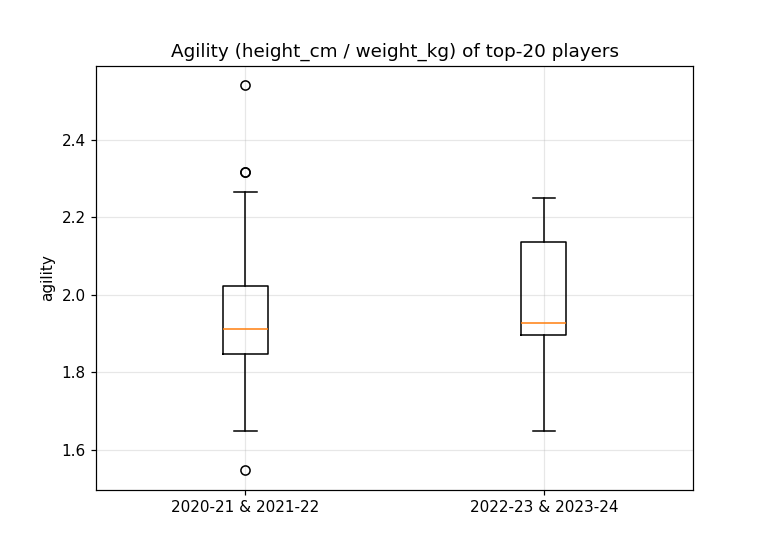
</p>

*Boxplot comparing the `agility` feature across groups tested in Hypothesis 1.*

### H2 — Innate Ability Hypothesis

<p align="center">
  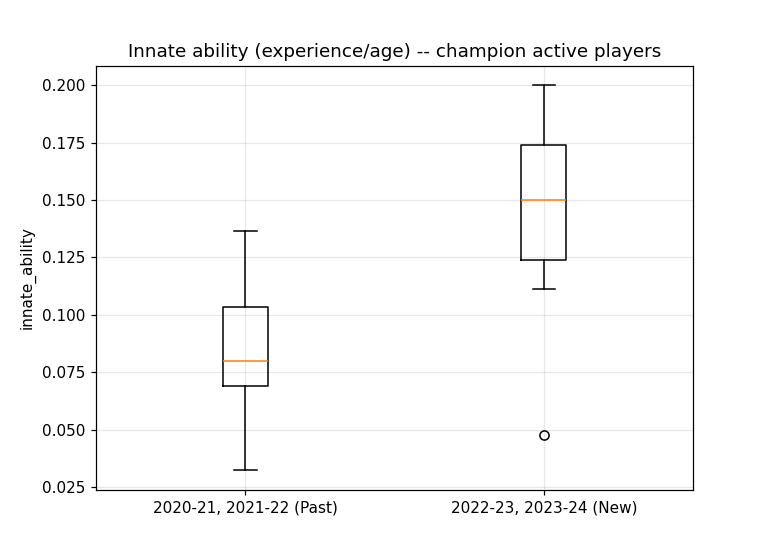
</p>

*Boxplot comparing the `innate_ability` feature across groups tested in Hypothesis 2.*

For the full statistical write-up, including hypotheses, test statistics, and p-values, see `analysis/analysis.ipynb` and `analysis/phase3_analysis.ipynb`.

### Player Clustering

Players are grouped into four clusters using K-Means based on advanced statistics such as:

- Minutes Played
- Win Shares
- WS/48
- VORP
- Experience
- Age

The resulting clusters represent:

- Elite Star Players
- Casual Players
- Veteran Role Players
- Rotation / Starting / Hardcore Players

<div align="center">
  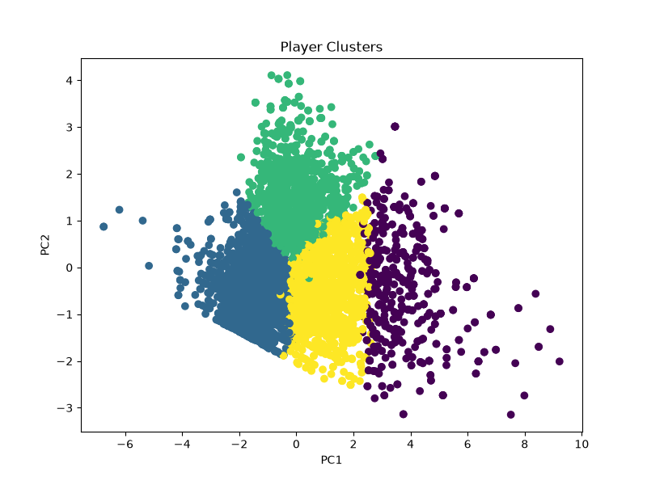
</div>

### Metabase Dsashboard

<div align="center">
  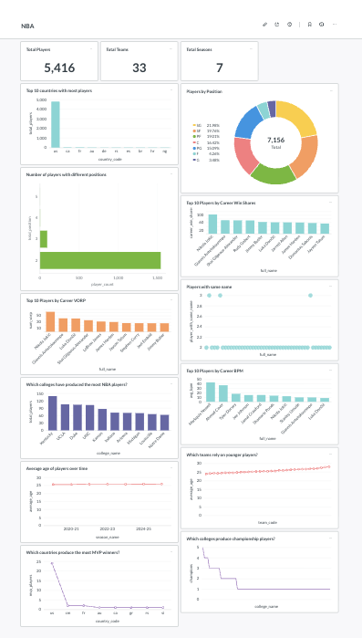
</div>

## Domain Knowledge

For background on the NBA concepts used throughout this project, see `NBA_Domain_Knowledge.md`.

## Data Source

Data for this project was collected from [Basketball-Reference.com](https://www.basketball-reference.com).
